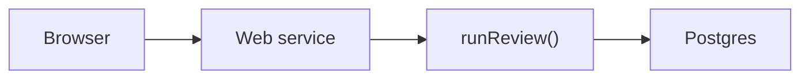
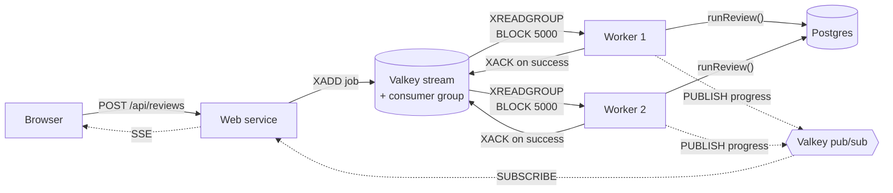
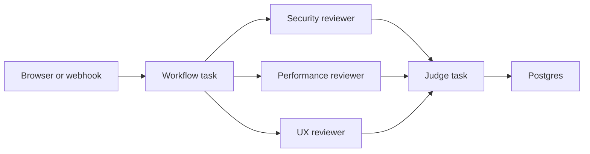

# From Demo to Deploy — Building Agents with Render Workflows

Bulleted slides for the localhost:2026 workshop. Speaker notes are under each
slide. 

---

## Slide 1 — Title

**Building Production-Grade Agents with Render Workflows**

localhost:2026

**Notes**

Hello. I am < Intro yourself >. Today, we're going to build and deploy agents on Render. We'll start simple, with a naive implementation that breaks at scale. Then, we'll look at a more sophsiticated architecture that can support scale, but adds complexity. Last, we'll take a look at Render Workflows, which offers a simple way to build and deploy agents with scalability, orchestration, and observability built-in.


---

## Slide 2 — Why this matters now

**Agent orchestration is a workflow problem first, an AI problem second.**

**Notes**

Agent orchestration is a workflow problem first, and an AI problem second. Through 2026, agents are crossing the line from demo to production, and teams keep discovering the same thing — the model call is the easy part. It's everything *around* the model call that's hard.

Think about what "production" actually demands. A run is no longer a single function call; it's a multi-step chain that has to survive a crash midway through. When one tool call fails, you want to retry just that step, not replay the whole run. You want each step isolated, so a slow reviewer doesn't starve the others. You want the work to scale independently, to be observable when it misbehaves, and to be durable across a deploy. None of that is artificial intelligence. That's orchestration, durability, retries, isolation, observability, and scale — the classic concerns of distributed systems, just wearing an LLM hat.

So the real question is: *how much of that infrastructure do you build and maintain yourself?* We'll answer that question three times today, with the exact same agent each time, shifting more of the substrate onto the platform with every pass. 

---

## Slide 3 — One pipeline, three substrates

**What we're building today**

- A PR goes in. A verdict comes out.
- Four specialist agents with tools and an LLM loop
- What changes is *where* and *how* it runs

**Notes**

We have one code-review pipeline: fetch a PR, filter out noise, fan out specialist reviewers in parallel, then a judge consolidates findings into an approve-or-request-changes verdict. The agents are defined once in a shared package. The security reviewer hunts for injection, auth gaps, secret exposure, and dependency risk — it has a `scan_for_secrets` tool. The performance reviewer targets N+1 queries, hot-path waste, unbounded memory, and blocking I/O — it has a `diff_stats` tool. The UX reviewer only joins when the diff touches frontend files, and it checks accessibility, state coverage, and interaction clarity — it has a `contrast_ratio` tool. The judge receives all findings, deduplicates, weighs severity, and returns a single approve-or-request-changes verdict as structured JSON. What changes is the infrastructure that runs them.

We will examine three patterns of deployment patterns. 

The naive agent pattern has a web service and database, but no separate orchestration layer. The worker agents pattern is powerful, but you own the queue and coordination code. The workflow agents pattern gives you the same power with managed orchestration. We're going to deploy each one and feel the difference.

---

## Slide 4 — Setup and first run

**Get everyone to a working agent before the first lab**

- Fork the repo into your GitHub account
- In GitHub Actions, run `setup-attendee.yml` to create your namespace
- Clone your fork locally
- Run `npm install`
- Run `npm run setup`
- Deploy Pattern 1 from `packages/naive-agent/render.yaml`
- Open the Web Service URL and submit the demo PR
- Click a run to inspect findings and spans

**Notes**

Quick orientation while you clone: the repo is an npm workspaces monorepo. `shared/` holds the constants every pattern reuses — `shared/agent/` is the engine (agents, LLM loop, tools, model client), `shared/db/` is the telemetry store (Postgres, or in-memory locally), and `shared/ui/` is the review viewer. The three patterns each live under `packages/` — `naive-agent`, `worker-agents`, and `workflow-agents` — and all three import the same agents, tools, and model client. Don't dwell here; just point out that the agent lives in `shared/` and the patterns differ only in how they run it, then move on to the deploy.


---

## Slide 5 — Pattern 1: The naive agent

**The simplest thing that works**




**Notes**
- The agent runs *inside* the HTTP request
- `POST /api/reviews` → `await runReview(prUrl)` → respond with verdict
- It works. Ship it?


---

## Slide 6 — Break it

**Three ways Pattern 1 fails**

- **Timeouts** — a large PR or a slow model blocks the request. Proxy kills it.
- **Lost on deploy** — redeploy mid-review, the in-flight work is gone. No durable state.
- **No scale** — concurrent users share one process. Parallel reviewers contend for one box.

**Notes**

DEMO: Talk through submitting a large PR — the request hangs. Or talk through what happens when you redeploy while a review is in progress. There's nowhere for the work to live outside this process. The problem isn't the agent. The problem is the execution model. We need to separate the thing that accepts the request from the thing that does the work.

---

## Slide 7 — Pattern 2: Queue + Worker



- The web tier becomes a thin producer — enqueue and return `202`
- A background worker consumes a Valkey stream and runs `runReview`
- The agent code is identical — same import, same function
- What you gain: durability (survives deploys), scale (add workers), async (non-blocking)
- What you pay: you now own the queue

**Notes**

DEMO: Submit a PR and get back 202 immediately. Tail the worker logs — the review runs in the background. Open an SSE stream and watch progress events arrive in real time. Scale to two workers — the consumer group splits the load. Kill the web service mid-review — the worker keeps going. This is powerful. But now open `kv.ts`.

---

## Slide 8 — The price of durability

**Everything in `kv.ts` is coordination code you now own**

- A Redis Stream with `XADD` / `XREADGROUP`
- A consumer group with named consumers
- Blocking reads with `BLOCK 5000`
- Message acknowledgements — `XACK` on success, leave pending on failure
- A pub/sub progress bus — `PUBLISH` / `SUBSCRIBE`
- A consumer loop that must never crash

**Notes**

The stream. The consumer group. Blocking reads. Message acknowledgements. Retries. The pub/sub bus for progress. The consumer loop that has to keep running even when a handler fails. These are all now your concern. This is the price of durability when you own the substrate. 

---

## Slide 9 — Lab 1: Hand-write message acknowledgements

**Implement `processEntry` in `kv.ts`**

- Handle one delivered stream entry
- On success → `XACK` (group never redelivers)
- On failure → don't ack, don't rethrow (message stays pending, loop keeps running)
- Verify: `npm run test:worker` (red → green)
- You just implemented at-least-once delivery

**Notes**

This is Session 1's hands-on. Open `processEntry` in `packages/worker-agents/src/kv.ts`. It currently throws. Your job: parse the entry, run the handler, then acknowledge the message on success. In Redis Streams, that acknowledgement is the `XACK` command. If the handler throws, log and return — never ack, never rethrow. The ack goes inside the try, after the handler. The catch logs and returns. Two tests flip from red to green: one checks that a success is acked, one checks that a failure stays pending. Give it 10 minutes. 

---

# — BREAK —

---

# SESSION 2 — Let the Platform Do It (~45 min)

---

## Slide 10 — Pattern 3: Render Workflows

**Same fan-out. Zero coordination code.**



- Each agent runs as a Render `task()` — its own isolated container
- `task()` = a config object + an async function
- Retries, timeouts, compute size, traces — declarative
- Composition is function calls: call a task from a task, `Promise.all` to fan out
- The queue, the consumer group, the acknowledgements, the pub/sub — gone

**Notes**

Same pipeline, same agents, same tools. But now every reviewer runs as its own Render task — isolated, retried, traced. The entire coordination layer from `kv.ts` collapses into a config object: `retry: { maxRetries: 2, waitDurationMs: 1000 }`. You don't write a queue. You don't write message acknowledgements. You don't manage a consumer group. You write a function and a config. Render does the rest.

---

## Slide 11 — Agents as tasks

```ts
const securityTask = task(
  { name: "security", timeoutSeconds: 120, retry: { maxRetries: 2 } },
  async (input, runId?) => {
    return securityReviewer.run(input, { tracer: storeTracer(), runId });
  },
);
```

- `task()` is the entire Render primitive — a config object + a function
- `agent.run()` is the same call naive-agent and worker-agents make
- Wrapping it in `task()` buys isolation, retries, and traces
- No wrapper file, no factory function — just the SDK call

**Notes**

Look at `code-review/index.ts`. Each reviewer is registered as a `task()` right there in the file. There's no separate bridge module. The config object is the retries you hand-wrote in Lab 1 — the ack inside the try, the catch that swallows errors — collapsed to `maxRetries: 2`. And `agent.run()` is byte-for-byte the same call the other two patterns make. Wrapping it in `task()` is what buys isolation, retries, and traces. That's the entire API surface.

---

## Slide 12 — Lab 2: Author a task

**Your turn — extend `your-review`**

1. **Preview it:** `render workflows tasks list --local` → `your-review` is already there
2. **Compose an agent as a task:**
   ```ts

   const securityTask = task(
     { name: "security", timeoutSeconds: 120 },
     async (input) => securityReviewer.run(input, { tracer: storeTracer() }),
   );
   const review = await securityTask({ patches });

   ```
   — nested `security` task appears in the trace
3. **Force a retry:** `if (Math.random() < 0.5) throw new Error("flaky!");` — watch Render retry in a fresh instance. Remove after.
4. **Fan out:** one `task()` per reviewer + `Promise.all` — same shape as `code-review`
5. **Ship it live:** push, release, start the task, open the trace

**Notes**

Open `your-review/index.ts`. It fetches a diff and returns an overview. It's your turn to extend it. Compose an agent as a nested task. Force a failure and watch the retry. Fan out all reviewers. Each step has a payoff, and each step reinforces the lesson: the capability is yours to write, the durability is the platform's. Coding agents welcome — the `task()` API is small enough that they can reason about them directly.

---

## Slide 13 — What you just built

**A durable, traced, multi-agent workflow**

- Specialist agents fan out in parallel, each in its own container
- Automatic retries with backoff — no try/catch, no dead-letter queue
- Full traces — every task, every LLM turn, every tool call
- Zero queue code. Zero consumer groups. Zero acknowledgement logic.

**Notes**

The only infrastructure you wrote was a function and a config object. Everything else — the queue, the retries, the isolation, the traces — is handled by the platform.

---

## Slide 14 — Where to go from here

**The production frontier**

- **Evals** — a labeled corpus + a scoring runner. Each case is a task. Fan out over the corpus.
- **Guardrails** — input sanitization, output validation, tool allow/deny lists. More steps, same pipeline.
- **Circuit breakers** — per-run budgets, model-tier fallbacks, backpressure caps. Config + a small state check.

---

## Slide 15 — The takeaway

- Pattern 1: simple, but fragile
- Pattern 2: powerful, but you own the hard parts
- Pattern 3: same power, the platform owns the hard parts
- Agents are the logic you write. Workflows are the infrastructure you don't.

**Resources**

- **This repo:** all three patterns, the mock model, the full test suite
- **Docs:** `workshop/participants/00` through `05` — the guided walkthrough
- **Render Workflows:** `render.com/docs/workflows`
- **Bonus points:** reflection loops, MCP tools, HITL gates → `workshop/participants/04-author-a-task.md`

**Notes**

Everything is in the repo. The guided docs walk through each pattern. The bonus points in doc 04 have three deeper challenges — a judge reflection loop, wiring in an MCP tool, and a human-in-the-loop gate. Each one reinforces the same lesson. The mock model means you can keep goineg with zero credentials. Thank you all.
